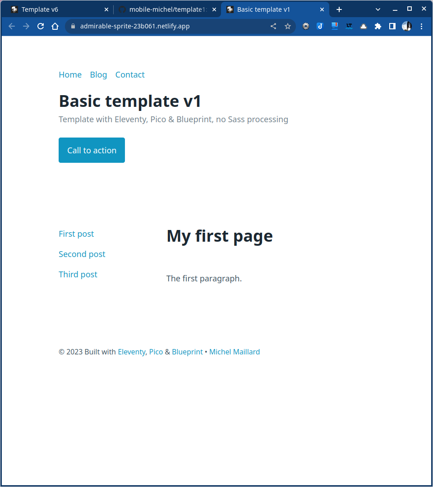

# Eleventy, Pico, Bootstrap, Blueprint without Sass processing

1. Installation
2. Layout with global data
3. Download Pico.css & Blueprint CSS
4. Create the posts & aside links
5. Push to GitHub & deploy to Eleventy

